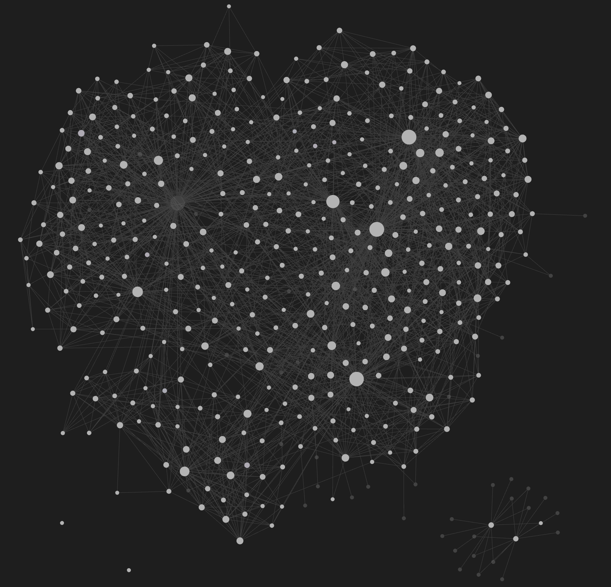

<p align="center">
  
</p>

<h1 align="center">vir</h1>

<p align="center">
  An LLM Wiki for Claude Code, in your Obsidian vault.
</p>

<p align="center">
  
</p>

<!--
GitHub topics (add manually: repo → About → ⚙ → Topics):
claude, claude-code, ai-memory, obsidian, knowledge-base, llm,
developer-tools, mcp, local-first, cross-platform, llm-wiki
-->

<p align="center">
  <a href="https://www.npmjs.com/package/@djolex999/vir-cli"></a>
  <a href="https://www.npmjs.com/package/@djolex999/vir-cli"></a>
  <a href="LICENSE"></a>
  <a href="#project-status"></a>
  <a href="#project-status"></a>
  <a href="https://modelcontextprotocol.io"></a>
  <a href="#"></a>
  <a href="https://github.com/djolex999/vir"></a>
</p>

That graph is my vault. Every node is a plain markdown file that vir wrote by
reading my Claude Code transcripts. It lives in Obsidian next to my own notes.
There is no server, no account, no export step. Uninstall vir tomorrow and the
vault stays yours.

## Two numbers

**354 sessions.** Claude Code prunes transcripts after about 30 days. 354 of my
sessions now exist nowhere except this vault. The decisions and gotchas inside
them would otherwise be gone.

**243 transcripts, about 20 mine.** Of the 243 transcripts on my machine, about
20 were sessions I actually drove. The rest were subagent runs, workflow
phases, and headless SDK agents. Vir detects all three kinds and skips them by
default. The vault holds your work, not your tooling's.

## Quick start

```bash
npm install -g @djolex999/vir-cli
vir init
vir run
```

`vir init` is a wizard: provider, models, vault path. `vir run` does one pass
over your sessions and writes notes. When you like the output,
`vir schedule install` registers a daemon that keeps the vault current.

## What it does

Vir reads transcripts from `~/.claude/projects`, filters out the noise,
classifies what survives with Haiku, and distills durable knowledge with
Sonnet. Notes are typed: patterns, gotchas, decisions, tools. Three input
sources feed one vault:

- **Claude Code sessions.** Retroactive: months of existing history become
  notes in one run.
- **Web articles** clipped to a folder, e.g. via Obsidian Web Clipper.
- **PDFs and papers.**

Everything embeds into one vector space (Ollama, optional, TF-IDF fallback).
`vir query "<question>"` searches it and synthesizes an answer. An MCP server
exposes the vault to Claude Code mid-session, so the agent consults past
decisions instead of rediscovering them. `vir sync-claude` feeds the best
notes back into your CLAUDE.md files, with a diff and your confirmation.

<p align="center">
  
</p>

```
Claude Code sessions
      ↓
     vir
      ↓
Obsidian vault
      ↓
  CLAUDE.md
      ↓
better sessions
      ↓
     ...
```

## The pattern

In April 2026, Andrej Karpathy described a pattern he calls the **LLM Wiki**:
AI work that feeds back into itself through a persistent, curated, structured
artifact, instead of resetting at the end of every session. He published the
idea file at
[karpathy/llm-wiki.md](https://gist.github.com/karpathy/442a6bf555914893e9891c11519de94f)
and ended his post saying: _"I think there is room here for an incredible new
product instead of a hacky collection of scripts."_

Several open source implementations of this pattern now exist
([lucasastorian/llmwiki](https://github.com/lucasastorian/llmwiki),
[Pratiyush/llm-wiki](https://github.com/Pratiyush/llm-wiki),
[nashsu/llm_wiki](https://github.com/nashsu/llm_wiki) among them). Each takes
a different shape.

Vir is the Obsidian-native one. It treats Obsidian as the primary frontend,
not just a storage location: a sidebar plugin
([vir-obsidian](https://github.com/djolex999/vir-obsidian)),
dataview-compatible frontmatter, wikilinked notes that show up in the graph.
It reads AI coding session transcripts retroactively, so months of existing
history become a queryable knowledge base in one run.

[Karpathy's post →](https://x.com/karpathy/status/2039805659525644595)

## Quality controls

Auto-distilled notes can be wrong. The most common concern from early users:
_"if your distillations are wrong, Claude treats them as truth and you get
worse results, not better."_ Fair. Vir addresses it in layers:

- **Transcript filtering.** Workflow transcripts, subagent sidechains, and
  headless SDK agent runs are detected structurally and excluded before any
  API call. Every skip is recorded with a reason, and every skip is
  reversible: flip the knob and the transcripts re-enter on the next run.
- **Project triage.** `vir projects` shows every project with session counts
  and estimated pending cost. Include or exclude each one. Undecided projects
  are a visible state, never a silent default.
- **Confidence scores on every note**, written into the frontmatter
  (`confidence: 0.xx`). A cheap heuristic pre-filter drops low-signal sessions
  before any LLM call; classification then scores what survives, and anything
  at or below `0.6` is dropped before the more expensive distill step.
- **Opt-in `CLAUDE.md` sync.** Nothing vir generates touches your prompt
  context automatically. `vir sync-claude` shows a diff and waits for your
  confirmation. You decide what reaches Claude.
- **Plain markdown output.** Every note is a file in your Obsidian vault. Read
  it, edit it, delete it. Nothing is hidden in a database you can't inspect.
- **Lint and dedupe.** `vir lint` flags contradictions and stale notes;
  `vir dedupe` merges near-duplicate notes that have drifted apart.
- **Active learning** via `vir review`. Walk through new distillations and
  approve, edit, or reject each one. Verified notes rank first in retrieval
  (in `vir query` and the MCP server). Rejected notes move to `.rejected/`,
  recoverable, not deleted.
- **MMR-diverse retrieval.** Queries return notes covering different aspects
  of the topic, not 5 similar duplicates.
- **Topic synthesis** via `vir compose "<topic>"`. Embedding-searches the
  vault for related notes and synthesizes them into a single topic page under
  `topics/`, with each source wikilinked so it backlinks in Obsidian's graph.
  `--dry-run` previews the sources and cost for free.
- **Cost transparency.** `vir run --dry-run` estimates per-session cost before
  you spend a cent; `vir cost` reports the actuals (total, median, p90, top
  sessions) from a local `~/.vir/cost.log`. Pricing is provider-aware
  (Anthropic list rates and Kie's discount), so the numbers reflect your
  bill, not a blended guess.
- **Reliable failures.** Every command exits non-zero on failure. A provider
  outage is one clear failure, not a retry storm: a cheap preflight probe
  runs before the distill loop. Sessions that fail 3 times in a row are
  parked until you retry them with `vir reconcile --force`.

The bet: with these controls, signal-to-noise stays high enough that the
vault is a net positive. If your discipline is strong enough to maintain
`CLAUDE.md` and `lessons.md` by hand, you may not need this. If, like most of
us, you let those files drift after the first week, vir catches what slips
through.

## How vir compares

The LLM Wiki space has grown fast. Honest comparison:

### vs other LLM Wiki implementations

|                                   | Vir                          | lucasastorian/llmwiki         | Pratiyush/llm-wiki                       | nashsu/llm_wiki           |
| --------------------------------- | ---------------------------- | ----------------------------- | ---------------------------------------- | ------------------------- |
| Language                          | TypeScript / Node            | Python                        | Python                                   | Cross-platform desktop    |
| Distribution                      | `npm install -g`             | Local app + hosted SaaS       | `git clone` + python                     | Desktop app installer     |
| Obsidian integration              | Native (sidebar plugin)      | Markdown output               | Outputs to vault                         | Own UI, no Obsidian       |
| Input sources                     | Claude Code, web clips, PDFs | PDFs, docs upload             | Claude Code, Cursor, Cline, Codex, Gemini | Documents, mixed sources  |
| Retroactive on existing sessions  | ✓                            | n/a                           | from install forward                     | n/a                       |
| MCP server                        | ✓                            | ✓                             | ✓                                        | ✓                         |
| License                           | MIT                          | open source + hosted commercial | MIT                                    | open source               |

### vs Claude Code memory tools

|                                     | Vir              | claude-mem           | claude-memory      | mem0              |
| ----------------------------------- | ---------------- | -------------------- | ------------------ | ----------------- |
| Reads existing Claude Code sessions | ✓                | from install forward | from install forward | n/a             |
| Markdown output                     | ✓                | ChromaDB             | LanceDB            | various backends  |
| Setup                               | `npm install -g` | Bun + uv + Python    | pnpm + LM Studio   | API/cloud setup   |
| License                             | MIT              | Apache 2.0           | MIT                | open core + cloud |

Different tools for different needs:

- **If you want a polished cross-platform desktop app** for general document
  knowledge bases, use lucasastorian/llmwiki or nashsu/llm_wiki.
- **If you want multi-agent support** with a rich entity/concept page taxonomy
  and don't care about Obsidian integration depth, use Pratiyush/llm-wiki.
- **If you want a heavyweight Claude Code memory plugin** with real-time
  capture and vector storage, use claude-mem.
- **If you're building AI applications that need to remember users**
  long-term, use mem0 (different layer entirely).
- **If you want an Obsidian-native LLM Wiki** that reads your existing Claude
  Code sessions, use vir.

## Numbers from a real run

Output from my first run across 226 Claude Code sessions:

| Metric              | Value                                             |
| ------------------- | ------------------------------------------------- |
| Sessions scanned    | 226                                               |
| Notes distilled     | 126                                               |
| Avg confidence      | 0.91                                              |
| High signal (≥0.8)  | 121 of 126                                        |
| Projects covered    | 8 projects                                        |
| Knowledge breakdown | 54 patterns · 47 decisions · 23 gotchas · 2 tools |

Other LLM Wiki implementations would produce similar results with the same
input. The distinguishing question for vir is workflow fit: does
Obsidian-native plus retroactive match how you actually work?

Example query against the distilled vault:

```bash
$ vir query "what gotchas should I know about my auth implementation"
```

Based on the notes, here are the key auth gotchas:

JWT dual-token setup needs silent refresh on mount. Access tokens
expire in 15 min; without a mount-time refresh check, users hit
401s on first load after a break.
Middleware runs before the session is hydrated. Do not read
session data in middleware to gate routes; check the JWT directly
from the cookie instead.
Password reset tokens must be single-use and hashed at rest.
Storing raw tokens in the DB leaks them if the DB is compromised.
OAuth callback URLs must be registered exactly. Trailing slashes,
http vs https, and localhost port mismatches all cause silent
redirect failures with no useful error message.
Logout must clear both the access token cookie and the refresh
token. Clearing only one leaves the session partially alive.

sources 4 · via embedding · searched 126

## Prerequisites

- macOS or Linux (systemd or cron)
- Node.js 20+
- Claude Code (sessions at `~/.claude/projects/`)
- Obsidian vault
- Anthropic API key **or** Kie.ai API key (~72% cheaper, same models)
- Optional: Ollama + `nomic-embed-text` for semantic search

## Cost

Vir runs two API calls per session: a Haiku classify (cheap) and a distill
(the main cost). Cost depends on session size and your provider.

### Real cost shape (measured on 226 historical sessions via Kie)

| Metric | Sonnet | Haiku |
|---|---|---|
| Median session | $0.07 | $0.025 |
| p90 session | $0.20 | $0.07 |
| Long-tail outliers (5-hour epics) | $0.25-$0.30 | $0.08-$0.10 |
| 226-session backfill | ~$21 | ~$7 |

Costs assume Kie.ai pricing (~28% of Anthropic direct). Multiply by ~3.5x for
Anthropic direct rates.

### What drives cost

Distill output dominates. A multi-hour session with hundreds of tool calls
distills to ~4500 output tokens, plus 25-30k input tokens after tool-call
filtering. Vir strips large tool outputs and oversized skill loads before
distillation; on one real 517-tool-call session that took the distill input
from ~217k to ~95k tokens without dropping signal.

### Cost controls

- `vir run --dry-run` previews per-session cost before any API call.
- `vir run` asks for confirmation when more than 20 new sessions are queued.
- `vir cost --since 7d` aggregates real (not estimated) token usage from
  `~/.vir/cost.log`; `--by-session` and `--top 5` surface outliers.
- `vir run --force-model haiku|sonnet` overrides the distill model per run.

### Hybrid routing

Haiku is ~3x cheaper than Sonnet and captures equal-or-more concrete detail
on routine and tool-heavy sessions. Calibration showed it only misses
higher-order architectural lessons on decision-heavy and very large sessions.
Hybrid routing exploits that. When `models.distillFast` is set, each session
routes after classification:

- `category === "decision"` → `models.distill` (Sonnet)
- `inputTokens > models.distillThreshold` (default `100000`) → `models.distill`
- otherwise → `models.distillFast` (Haiku)

New installs (`vir init`) enable hybrid by default. Existing installs are
unaffected on upgrade: with `distillFast` unset, `models.distill` is used for
every session exactly as before.

## Platform support

| Platform        | Daemon             | Notifications | Status       |
| --------------- | ------------------ | ------------- | ------------ |
| macOS           | launchd            | osascript     | Stable       |
| Linux (systemd) | systemd user timer | notify-send   | Experimental |
| Linux (cron)    | crontab            | notify-send   | Experimental |
| Windows         | Not supported      | none          | Planned      |

Linux support is **experimental and untested**. `vir schedule install`
prefers a systemd user timer and falls back to a crontab entry when systemd
is absent. Please report issues at
[github.com/djolex999/vir/issues](https://github.com/djolex999/vir/issues)
with your distro, init system, and Node version.

## Commands

| Command                     | Cost  | Description                               |
| --------------------------- | ----- | ----------------------------------------- |
| `vir init`                  | free  | Interactive setup                         |
| `vir run`                   | cheap | Process new sessions                      |
| `vir run --full`            | $$    | Reprocess all sessions                    |
| `vir run --rewrite-only`    | free  | Reformat notes, no API calls              |
| `vir run --articles-only`   | cheap | Distill only web articles                 |
| `vir run --pdfs-only`       | $$    | Distill only PDFs                         |
| `vir run --dry-run`         | free  | Estimate per-session cost, exit before LLM |
| `vir run --force-model <m>` | cheap | Override distill model: `haiku` \| `sonnet` |
| `vir projects`              | free  | Per-project triage: counts + pending cost |
| `vir projects include <p>`  | free  | Track a project                           |
| `vir projects exclude <p>`  | free  | Stop tracking (existing notes untouched)  |
| `vir cost`                  | free  | API cost report (total/median/p90/top)    |
| `vir query "<question>"`    | cheap | Semantic search your vault                |
| `vir queries`               | free  | Retrieval report: method split, degraded rate, dead-weight notes |
| `vir compose "<topic>"`     | $$    | Synthesize a topic page from related notes |
| `vir summarize <project>`   | cheap | Cross-session project synthesis           |
| `vir summarize --week`      | cheap | Period summary of the week's notes        |
| `vir lint`                  | cheap | Find orphans, stale notes, contradictions |
| `vir dedupe`                | cheap | Interactive duplicate detection + merge   |
| `vir review`                | free  | Walk new notes: approve/edit/reject       |
| `vir sync-claude`           | free  | Inject top knowledge into CLAUDE.md       |
| `vir embed`                 | free  | Generate embeddings for semantic search   |
| `vir embed --setup`         | free  | Install the local embedding provider (no Ollama needed) |
| `vir schedule install`      | free  | Register the background daemon            |
| `vir status`                | free  | Knowledge base breakdown + daemon status  |
| `vir doctor`                | cheap | 13 install/config checks                  |
| `vir reconcile`             | $$    | Retry sessions that failed, cache-bypassed |
| `vir mcp install`           | free  | Register the MCP server with Claude Code  |

Most commands take `--dry-run`, `--yes`, or `--json` where they make sense;
run `vir <command> --help` for the full flag list. `vir query --json` and
`vir doctor --json` are the machine contracts the
[vir-obsidian](https://github.com/djolex999/vir-obsidian) plugin consumes.

## MCP server (Claude Code integration)

Vir runs as an MCP server, letting Claude Code consult your vault mid-session
instead of relying on static CLAUDE.md content.

```bash
vir mcp install
```

Restart Claude Code. The vault is now queryable mid-session via six tools:
`vir_query`, `vir_status`, `vir_recent_notes`, `vir_recent_articles`,
`vir_project_summary`, `vir_compose`. `vir_query` takes a `type` filter
(`session` | `article` | `topic` | `pdf` | `all`). Human-verified notes
(approved via `vir review`) rank first; pass `verified_only: true` to see
only those. The server is read-only: it never spends tokens and never writes
files.

To unregister: `vir mcp uninstall`.

## Semantic search (optional)

Vir works out of the box with keyword search (TF-IDF). No embedding setup is
required, ever. For semantic search, pick one of two providers; vir detects
whichever is present:

**One command, no Ollama:**

```bash
vir embed --setup      # installs fastembed + bge-small-en-v1.5 into ~/.vir
                       # (~233 MB + ~128 MB model; states cost, asks first)
```

**Or Ollama** (768d, slightly larger model):

```bash
brew install ollama
ollama pull nomic-embed-text
ollama serve
```

Then:

```bash
vir embed
vir query "how do I handle rate limiting in Next.js"
```

Every stored vector records the model that produced it. Vectors from
different models are never compared; if you switch providers,
`vir embed --force` re-embeds the index after telling you what it costs.
Falls back to keyword search automatically when no provider is available,
and says so: `via tfidf (no provider)`. MMR reranking balances relevance
against diversity, tunable via `retrievalDiversity` (default 0.3).

## Config reference

Located at `~/.vir/config.json`.

| Field               | Default                     | Description                                                |
| ------------------- | --------------------------- | ---------------------------------------------------------- |
| `vaultPath`         | (required)                  | Absolute path to Obsidian vault                            |
| `outputDir`         | `vir`                       | Subdir inside vault                                        |
| `claudeProjectsDir` | `~/.claude/projects`        | Claude Code sessions                                       |
| `cadenceHours`      | `3`                         | Daemon run frequency (hours)                               |
| `provider`          | `anthropic`                 | `anthropic` or `kie`                                       |
| `anthropicApiKey`   | (unset)                     | Required if `provider=anthropic`                           |
| `kieApiKey`         | (unset)                     | Required if `provider=kie`                                 |
| `filterThreshold`   | `0.4`                       | Heuristic pre-filter (0..1)                                |
| `articlesDir`       | (unset)                     | Folder of clipped articles. Unset → article ingestion off  |
| `pdfsDir`           | (unset)                     | Folder of PDFs. Unset → PDF ingestion off                  |
| `workflowTranscripts` | `exclude`                 | Workflow/sidechain transcripts: `exclude` \| `include`     |
| `agentTranscripts`  | `exclude`                   | Headless SDK agent transcripts: `exclude` \| `include`     |
| `projects`          | (unset)                     | Per-project `include`/`exclude` map; absent = undecided    |
| `filterToolCalls`   | `moderate`                  | Tool-output filtering: `aggressive` \| `moderate` \| `off` |
| `retrievalDiversity`| `0.3`                       | MMR diversity (0..1)                                       |
| `logQueries`        | `true`                      | Log retrievals to `~/.vir/queries.jsonl`; `false` = off    |
| `embeddingProvider` | (unset)                     | `ollama` \| `local` \| `none`; unset = auto-detect         |
| `models.classify`   | `claude-haiku-4-5-20251001` | Classify model                                             |
| `models.distill`    | `claude-sonnet-5`           | Distill model for decision-heavy and large sessions        |
| `models.distillFast`| (unset)                     | Cheap model for routine sessions; set → hybrid routing on  |
| `models.distillThreshold` | `100000`              | Input-token ceiling above which `distill` is forced        |
| `pricing`           | (built-in)                  | Optional per-provider `$/1M` overrides                     |

## Vault structure

```
vault/vir/
  index.md       # full catalog of every note vir has written
  log.md         # chronological append log of each run
  patterns/      # reusable approaches worth repeating
  gotchas/       # bugs, footguns, and edge cases
  decisions/     # architecture decisions with their rationale
  tools/         # per-tool knowledge and usage notes
  articles/      # web articles distilled from your clips folder
  pdfs/          # distilled PDFs and papers
  topics/        # synthesized topic pages (vir compose)
  projects/      # cross-session project summaries
  summaries/     # weekly/monthly period summaries (derived, never indexed)
  archived/      # deduplicated notes (kept, never deleted)
```

## State & logs

```
~/.vir/config.json   # configuration
~/.vir/vir.db        # SQLite (hashes, embeddings, content)
~/.vir/cost.log      # per-call cost records (JSONL)
~/.vir/daemon.log    # daemon run log
~/.vir/queries.jsonl # retrieval log (JSONL, rotates at 5 MB, one .1 kept)
```

### Query logging

Every `vir query` and MCP `vir_query` retrieval appends one record to
`~/.vir/queries.jsonl`: the query text, which notes surfaced at what rank and
score, the search method (embedding vs TF-IDF fallback), and latency. It never
records the synthesized answer.

This log stays on your machine — it is **never transmitted anywhere**. It
exists so `vir queries` can tell you which notes actually earn their place in
retrieval (and which never surface), and it is the baseline for future ranking
improvements. Delete it any time; disable it with `"logQueries": false` in
`~/.vir/config.json`.

## Project status

|                |                                           |
| -------------- | ----------------------------------------- |
| Version        | 0.14.1                                    |
| Tests          | 441 passing                               |
| Platforms      | macOS (launchd), Linux (systemd/cron)     |
| Node           | 20+                                       |
| First-run cost | $1 to $5 (Kie.ai optional, ~72% cheaper)  |
| Ongoing cost   | ~$0.05 per run                            |

## Roadmap

Shipped:

- [x] Linux support (systemd timer + cron fallback), experimental
- [x] Active learning: `vir review`, verified notes ranked first in retrieval
- [x] Web article ingestion (Obsidian Web Clipper folder → same vault)
- [x] PDF and paper ingestion
- [x] Obsidian plugin: [vir-obsidian](https://github.com/djolex999/vir-obsidian), sidebar queries against the vault
- [x] Topic synthesis: `vir compose` builds topic pages from related notes
- [x] Transcript filtering: workflow, sidechain, and SDK-agent transcripts detected and skipped by default
- [x] Project triage: `vir projects`, per-project include/exclude with pending-cost estimates
- [x] Duplicate detection and merge: `vir dedupe`

Not built:

- [ ] Windows support
- [ ] GUI installer for non-developers
- [ ] More input sources: code repos, images
- [ ] Export to anchor-plugin skill format
- [ ] Other coding agents. Cursor and Codex CLI write transcripts too, and
      the parser is the only Claude-specific stage. Possible, not scheduled.

## Contributing

PRs welcome. Open an issue first for large changes. Built with TypeScript
strict; run `npm run build` and `npm test` before submitting. See
[CONTRIBUTING.md](CONTRIBUTING.md) for development setup.

```bash
git clone https://github.com/djolex999/vir
cd vir
npm install
npm run build
npm test
```

## License

MIT

## Author & credits

Built by Djordje Marković / GrowthQ Lab DOO.

Vir (вир) is the Serbian word for _whirlpool_: the place where a river pulls
everything in and concentrates it. Sessions flow in, vir pulls out what
matters, and deposits it somewhere permanent.

Inspired by Andrej Karpathy's LLM Wiki pattern and Uros Pesic's KB Brain
concept.

[GitHub](https://github.com/djolex999) ·
[LinkedIn](https://www.linkedin.com/in/djmarkovic/) ·
[npm](https://www.npmjs.com/~djolex999) ·
[GrowthQ Lab](https://growthqlab.com)
